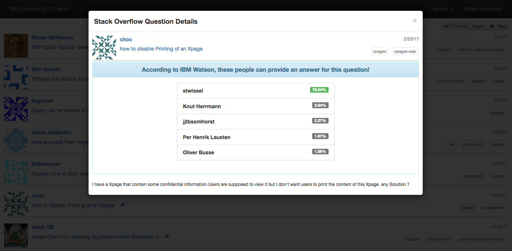

# IC17RestDemo
IBM Connect 2017 Session Demo: "Your Data In the Major Leagues: A Practical Guide to REST Services"

[Slides](https://speakerdeck.com/sbasegmez/ibm-connect-2017-your-data-in-the-major-leagues-a-practical-guide-to-rest-services)

### Stackoverflow—IBM Watson Demo

For this demo, IBM Watson Natural Language Classifier service has been trained to answer which Stackoverflow users can answer a specific question. For those who want to follow the same trails and be able to run this demo, you should follow the steps below. The training part might be an uncomfortable zone for you. If so, feel free to contact me about it. I can provide some data. 

#### Training IBM Watson Natural Language Classifier

We start with pulling questions from Stackoverflow. Here is [a link for the query](https://data.stackexchange.com/stackoverflow/query/620638/xpages-tag-question-text-with-answer-owners) you'll need.

```sql
SELECT

P.id as QuestionPostId,
P.OwnerUserId as QuestionOwnerId,
P.AcceptedAnswerId as QuestionAnswerId,
P.Body as QuestionBody,
P.Title as QuestionTitle,
P.Tags as QuestionTags,
P.AnswerCount as AnswerCount,

STUFF(
  (SELECT 
    DISTINCT ',' + U.DisplayName
   FROM Posts as A, Users as U    
   WHERE 
     A.ParentId = P.id
     AND
     A.OwnerUserId = U.id
   FOR XML PATH ('')
  )
, 1, 1, '')as AnswerUsers


From Posts as P, PostTags as Tags

Where

P.AnswerCount>0
AND
P.PostTypeId = 1
AND
P.id = Tags.PostId
AND
Tags.TagId in (66326, 80737, 80738)
```

After running this query, export the results as a comma-separated file and name it `sodata.csv`

Now we will need to prepare this in an appropriate format. The quickest way is to use Python for the preparation part. We have two scripts for preparing the file to be uploaded and submit the result to the classifier.

To run those scripts, you will need [Python 3.x](https://www.python.org/downloads/), [Pandas](http://pandas.pydata.org/pandas-docs/stable/install.html) and IBM Watson Natural Language Classifier [Python SDK](https://github.com/watson-developer-cloud/python-sdk). 

The first script, [SO_Data.py](_doc/SO_Data.py) will get the data from `sodata.csv` in the same folder and analyze all questions and users. It will filter out question texts and also users who has less than 10 answers. Then result will be formatted as `text,user1,user2,…` and written into a new file named as `output.csv`.

At this point, you will need to use Bluemix to create a new Natural Language Classifier. Open your Bluemix console, login and go to [Watson Catalog](https://console.ng.bluemix.net/catalog/?category=watson). Create a new Natural Language Classifier using the [documentation](https://www.ibm.com/watson/developercloud/doc/natural-language-classifier/getting-started.html). We will need credentials data to upload our training data.

The second script, [WatsonPush.py](_doc/WatsonPush.py) will use IBM Watson SDK to send the `output.csv` file to the new classifier we just created. But first, open the script in a text editor and fill in the credentials. When you run the script, it will print out the response coming back from the Watson NLC. We will need the classifier id in this response. 

The training takes a long time (sometimes, more than a day!). To check the status, you might use the script (, or open the service page from the  [dashboard](https://console.ng.bluemix.net/dashboard/watson) and access to the beta toolkit.

#### Running XPages Demo

The demo needs the IBM Watson NLC credentials and the classifier id we obtained in the previous section. Create the NSF database from the on-disk project and create/edit configuration document in the `config` view. 

When working properly, Stackoverflow page will display unanswered questions asked with **#XPages** tag from the Stackoverflow site. You can click any question and use "Ask IBM Watson" button in the dialog.



#### Implementation for XPages Demo

The entry point is [stackoverflow.xsp](odp.ic17restdemo/XPages/stackoverflow.xsp) page which displays [soQuestions.xsp](odp.ic17restdemo/CustomControls/soQuestions.xsp) custom control. This is using [StackOverflowBean.java](odp.ic17restdemo/Code/Java/com/developi/demo/so/StackOverflowBean.java) to pull Stackoverflow questions and cache pages for navigation. The RESTful consumer is the following method:

```java
	private void pullCurrentPage() {

		CloseableHttpClient httpclient = HttpClients.createDefault();
		CloseableHttpResponse response = null;

		try {
			URIBuilder builder = new URIBuilder(BASEURL + "/questions/no-answers");
			builder.addParameter("order", "desc");
			builder.addParameter("sort", "activity");
			builder.addParameter("tagged", "xpages");
			builder.addParameter("site", "stackoverflow");
			builder.addParameter("filter", FILTER);
			builder.addParameter("page", String.valueOf(currentPage + 1));
			builder.addParameter("pagesize", String.valueOf(PAGESIZE));

			response = httpclient.execute(new HttpGet(builder.build()));

			HttpEntity entity = response.getEntity();
			parseResults(EntityUtils.toString(entity));

		} catch (IOException e) {
			e.printStackTrace();
		} catch (URISyntaxException e) {
			e.printStackTrace();
		} finally {
			try {
				if (response != null) {
					response.close();
				}
			} catch (IOException e) {
			}
		}
	}
```

Question details opened up in a dialog and we consume RESTful API of IBM Watson using a button in the dialog. The communication with Watson is performed in [WatsonBean.java](odp.ic17restdemo/Code/Java/com/developi/demo/watson/WatsonBean.java) using the following code:

```java
	private String ask(Question question) {
		JsonJavaObject requestJson = new JsonJavaObject();
		requestJson.put("text", clearText(question));
		
		CloseableHttpClient httpClient = null;
		CloseableHttpResponse response = null;

		try {
			URIBuilder builder = new URIBuilder(nlUrl + "/v1/classifiers/"+nlClassifierId+"/classify");
			
			CredentialsProvider credsProvider = new BasicCredentialsProvider();
	        credsProvider.setCredentials(
	                new AuthScope(builder.getHost(), builder.getPort()),
	                new UsernamePasswordCredentials(nlUsername, nlPassword));
			
			httpClient = HttpClients.custom().setDefaultCredentialsProvider(credsProvider).build();
			
			HttpPost post = new HttpPost(builder.build());
			StringEntity reqEntity = new StringEntity(requestJson.toString(), ContentType.APPLICATION_JSON);
			post.setEntity(reqEntity);
			
			response = httpClient.execute(post);

			HttpEntity entity = response.getEntity();

			return EntityUtils.toString(entity);

		} catch (IOException e) {
			e.printStackTrace();
		} catch (URISyntaxException e) {
			e.printStackTrace();
		} finally {
			try {
				if (response != null) {
					response.close();
				}
			} catch (IOException e) {
			}
		}
		
		return "Error!";
	}
```

### Box Demo

The demo application provides two different modules for Box: A RESTful service for Box Webhooks and another one for OAuth2. For these modules to run, you first need to create a Box Application.

- Login to [Box Developer site](https://developer.box.com/)
- Use "[Create Box Application](https://developi.app.box.com/developers/services/edit/)" link on the right.
- Name your application
- Make sure you have the right information on the following fields:
  - Redirect URI should match with a secure URL accessible for your test environment. We'll use it for the OAuth2 dance. 
  - We need to use "Content API Access Only" option for the demo.
  - Authentication type: "Standard Authentication (3-legged OAuth2.0)"
  - Scopes should contain "Manage webhooks v2" option
- Create a new developer token here. This will be valid for an hour only. After that you can create a new one. "developer token" will be needed for the Webhooks demo.
- Open the demo database config (from `config` view) and record "redirect_url", "client_id" and "client_secret".  Also provide a valid mail address for the "Notify User on Webhook" to get new file notifications in the webhook demo.

#### Webhooks Demo

For Webhooks, our application needs to be on a Domino server that can be accessed securely (TLS 1.2) from anywhere. There are two webhooks implementation in Box. Classical Webhooks can be defined using the developer console but it cannot be targeted for a specific object (i.e. files and folders). Webhooks v2 is the one we will use. Unfortunately, Box has no interface for this service. So we need to use manual methods to register a new webhook.

Basically, we will create a webhook that will monitor a specific folder on our Box drive. Box will notify our demo service for changes. Demo service will create/manipulate "boxfile" documents on the demo database according to the notification it gets from Box.

- Create a folder on your Box drive and write down its folder id
  - When you navigate to the folder on your browser, URL ends with the folder id.
- You can use [Postman](https://www.getpostman.com/) to define a new webhooks. Just import [IC17_REST.postman_collection.json](_doc/IC17_REST.postman_collection.json) into your Postman client
  - Open "Create Webhook on Box" request
  - Enter the developer token you have created before into Authorization variable in the Headers section. Do not delete the "Bearer" prefix.
  - In JSON body, make sure you have the right folder id and the correct url for your service. 
  - Once you have created the webhook definition, you can check the list of webhooks created with the "Get Webhooks" request on the same collection. Make sure you have the developer token on this request as well.
- Now you can test the new webhook.
  - For each event in the folder we are watching, a new notification will be sent. You might see the incoming webhooks notifications in "notifications" view in our demo database.
  - When you upload any file to the folder, notification will be processed by the RESTful service
    - A new document with `boxfile` form will be created.
    - A notification e-mail will be sent to the e-mail address defined in the config document.
  - When you comment any file in this folder, comment will be added to the related `boxfile` document.
  - When you delete a file, the related `boxfile` document will be marked as deleted.
- Some tweaks:
  - I had some issues with the SSL configuration on my server. Some SSL certificates are not trusted by the Box API and you get no notification about such an issue.
  - Sometimes, webhooks are sending the notification a couple of minutes later than the event. 

#### OAuth2 Dance

3-legged OAuth2 dance is a complicated process but a great example of RESTful services. I have implemented a simple RESTful service to demonstrate the concept in this demo. Here is how it works.

- When you open the Box Demo page on the demo application, you'll see a button for login. 
- If you click this button, XPages will redirect you to the login page of Box to request authorization for the application we have created. The login page link is constructed with the `client_id` of our application.
- When user logs in to the Box and accept the authorization request, Box will redirect the user to our service (redirect_url) with a temporary code (valid for 30 seconds).
  - URL of the service is `https://your.server.url/path/to/ic17restdemo.nsf/services.xsp/boxCallBack`
- RESTful service will get the temporary code, combine with the `client_secret` code and send a POST request to the Box API.
- Box API will return two tokens and the RESTful service will save these tokens for further operations:
  - Access Token (valid for an hour) is what we need to access Box API for further requests
  - Refresh Token (valid for 60 days) is used to get a new access token when the old one expires.
  - Saved tokens are not encrypted and they provide access to everything on the Box. Protect these tokens.
- After refreshing the Box demo page, we can navigate in the Box folders. When we navigate user's Box files, we will add the access token to every requests we sent to Box API. If access token is expired, it will be renewed automatically by the refresh token.

#### Under the hood

The implementation contains two RESTful services in [services.xsp](odp.ic17restdemo/XPages/services.xsp). 

The webhook notifications are handled by [NotificationServiceBean.java](odp.ic17restdemo/Code/Java/com/developi/demo/box/NotificationServiceBean.java):

```java
	@SuppressWarnings("unchecked")
	@Override
	public void renderService(CustomService service, RestServiceEngine engine) throws ServiceException {

		HttpServletRequest request = engine.getHttpRequest();
		HttpServletResponse response = engine.getHttpResponse();

		Map<String, String> headers = new HashMap<String, String>();

		Enumeration headerNames = request.getHeaderNames();
		while (headerNames.hasMoreElements()) {
			String key = (String) headerNames.nextElement();
			String value = request.getHeader(key);
			headers.put(key, value);
		}

		StringBuffer sb = new StringBuffer();

		BufferedReader reader;
		try {
			reader = request.getReader();
			String line;
			while ((line = reader.readLine()) != null) {
				sb.append(line);
			}
		} catch (IOException e) {
			e.printStackTrace();
			throw new ServiceException(e, ResponseCode.INTERNAL_ERROR);
		}

		String data = sb.toString();

		try {
			process(headers, data);
			response.setStatus(200);
			response.setContentType("text/plain");
			PrintWriter out = response.getWriter();
			out.println("DONE");
			out.close();
			out.flush();
		} catch (Exception e) {
			e.printStackTrace();
			throw new ServiceException(e, ResponseCode.INTERNAL_ERROR);
		}

	}
```

OAuth callback is handled by [BoxBean.java](odp.ic17restdemo/Code/Java/com/developi/demo/box/BoxBean.java). The following method acquires the temporary code:

```java
	@Override
	public void renderService(CustomService service, RestServiceEngine engine) throws ServiceException {

		HttpServletRequest request = engine.getHttpRequest();
		HttpServletResponse response = engine.getHttpResponse();

		try {
			String code = request.getParameter("code");
			
			processCode(code);
			
			response.setStatus(200);
			response.setContentType("text/html");
			PrintWriter out = response.getWriter();
			out.println("<html><body onload=\"window.close();\">SUCCESS!</body><html>");
			out.close();
			out.flush();
		} catch (Exception e) {
			e.printStackTrace();
			throw new ServiceException(e, ResponseCode.INTERNAL_ERROR);
		}
	}
```

The incoming code is processed by the following method which completes the interaction by getting tokens needed:

```java
	private void processCode(String code) {
		CloseableHttpClient httpclient = HttpClients.createDefault();
		CloseableHttpResponse response = null;

		try {
			URIBuilder builder = new URIBuilder(BASEURL_TOKEN);
			HttpPost post = new HttpPost(builder.build());

			HttpEntity reqEntity = MultipartEntityBuilder.create()
			.addTextBody("grant_type", GRANTTYPE_NEWTOKEN)
			.addTextBody("code", code)
			.addTextBody("client_id", clientId)
			.addTextBody("client_secret", clientSecret)
	        .build();
			
			post.setEntity(reqEntity);
			response = httpclient.execute(post);

			HttpEntity entity = response.getEntity();
			String data = EntityUtils.toString(entity);
			
			if(response.getStatusLine().getStatusCode() == HttpStatus.SC_OK) {
				Token token = new Token();
				processToken(token, data);
				tokens.put(token.getOwner(), token);
			} else {
				System.out.println("Error returned Creating Token: " + response.getStatusLine().toString());
				System.out.println(data);
			}

		} catch (IOException e) {
			e.printStackTrace();
		} catch (URISyntaxException e) {
			e.printStackTrace();
		} finally {
			try {
				if (response != null) {
					response.close();
				}
			} catch (IOException e) {
			}
		}	
	}
```


### Licenses and Credits

This demo repository contains the following libraries shared under Apache License 2.0

- [Apache Commons Lang](https://commons.apache.org/)
  Copyright 2001-2016 The Apache Software Foundation

- [Apache Commons Codec](https://commons.apache.org/)
  Copyright 2002-2016 The Apache Software Foundation

- [Apache Commons Logging](https://commons.apache.org/)
  Copyright 2003-2016 The Apache Software Foundation

- [Apache HttpComponents Client](https://hc.apache.org/httpcomponents-client-ga/)
  Copyright 1999-2016 The Apache Software Foundation

- [IBM Commons Library](https://github.com/OpenNTF/SocialSDK/tree/master/commons/com.ibm.commons) (from [IBM Social Business Toolkit SDK](https://github.com/OpenNTF/SocialSDK) Project)

  Copyright IBM Corp. 2010, 2013


The following resources are used remotely (no code included in project). Note that your use of these resources is governed by the Terms of Service (or Terms of Use) of the respective resource.  It is your responsibility to ensure compliance with such terms. 

Stackoverflow REST API - https://stackoverflow.com/
Box REST API - https://www.box.com/
IBM Watson Rest API - https://www.ibm.com/watson/
Fixer.io REST API http://fixer.io/